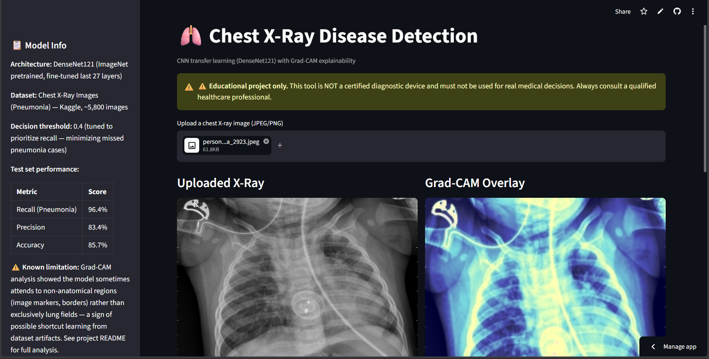

# 🫁 Chest X-Ray Disease Detection using Deep Learning

A CNN-based pneumonia detection system built with transfer learning (DenseNet121), explainable AI (Grad-CAM), and deployed as an interactive web app — with an honest evaluation of the model's real limitations, not just its headline accuracy.


🔗 **[Live Demo](https://chest-x-ray-disease-detection.streamlit.app/)** &nbsp;•&nbsp; 📓 **[Notebook](https://github.com/TAYAB-HUB/Chest-X-Ray-Disease-Detection/blob/main/Chest%20X-Ray%20Disease%20Detection%20using%20CNN.ipynb)** &nbsp;•&nbsp; 📊 **[Dataset](https://www.kaggle.com/datasets/paultimothymooney/chest-xray-pneumonia)**

---

## 📌 Project Overview

This project builds a deep learning model that classifies chest X-ray images as **NORMAL** or **PNEUMONIA**, using transfer learning on DenseNet121 (pretrained on ImageNet). Beyond just training a classifier, this project focuses on the practices that separate a real ML workflow from a tutorial copy-paste:

- Fixing a broken validation split before trusting any metric
- Explicitly handling class imbalance with computed class weights
- Comparing a from-scratch CNN baseline against transfer learning
- Tuning the decision threshold based on which error type actually matters in a medical context
- Using Grad-CAM to visualize *what* the model is looking at — and honestly reporting where it's looking at the wrong thing

**⚠️ Disclaimer:** This is an educational/portfolio project. It is **not** a certified medical device and must never be used for real diagnostic decisions. Always consult a qualified healthcare professional.

---

## 📊 Dataset

**Source:** [Chest X-Ray Images (Pneumonia) — Kaggle](https://www.kaggle.com/datasets/paultimothymooney/chest-xray-pneumonia)

- ~5,800 pediatric chest X-ray images (anterior-posterior view)
- 2 classes: `NORMAL`, `PNEUMONIA`
- Originally split into `train` / `val` / `test` folders

### Data issues found and fixed

| Issue | Fix |
|---|---|
| Official `val` split had only 16 images total — too small to give a reliable validation signal | Merged `train` + `val`, re-split with an 85/15 stratified split |
| Class imbalance: PNEUMONIA outnumbers NORMAL ~2.9x in training data | Computed `class_weight="balanced"` weights and passed them into `model.fit()` |
| `test` set showed a distribution shift from `train`/`val` (likely different patient population/imaging equipment) | Kept `test` set completely untouched and used it as the sole source of truth for final model comparison — never used for tuning |

### Sample predictions with Grad-CAM (NORMAL cases)


*Grad-CAM overlay showing where the model focused for a correctly-predicted NORMAL X-ray. See [Limitations](#️-key-limitation-discovered) for cases where hot regions fall outside lung tissue.*

---

## 🧠 Methodology

### 1. Baseline CNN (from scratch)
A simple 3-block CNN (Conv2D → MaxPooling ×3 → GlobalAveragePooling → Dense) trained from scratch to establish a reference point before reaching for a pretrained model.

### 2. Transfer Learning (DenseNet121)
- Base: DenseNet121, pretrained on ImageNet, `include_top=False`
- **Phase 1:** Base frozen, only a new classification head trained
- **Phase 2:** Top ~27 layers of DenseNet121 unfrozen and fine-tuned at a low learning rate (`1e-5`)

### 3. Data augmentation
`RandomFlip("horizontal")`, `RandomRotation(0.05)`, `RandomZoom(0.1)`, `RandomContrast(0.1)` — deliberately **no vertical flip and no heavy rotation**, since chest anatomy has a fixed, biologically meaningful orientation and unrealistic augmentations would teach the model to expect anatomically impossible patterns.

### 4. Class imbalance handling
`sklearn.utils.class_weight.compute_class_weight("balanced", ...)` — penalizes misclassifying the minority class (NORMAL) more heavily during training.

### 5. Threshold tuning
Rather than using the default 0.5 cutoff, the decision threshold was tuned against the precision-recall tradeoff — see [Results](#-results) below.

---

## 📈 Results

### Baseline vs Transfer Learning (validation set)

| Metric | Baseline CNN | DenseNet121 (frozen) |
|---|---|---|
| Accuracy | 85.35% | 96.18% |
| Precision | 98.55% | 99.11% |
| Recall | 81.48% | 95.71% |
| Loss | 0.3082 | 0.0971 |

### Frozen vs Fine-tuned (held-out test set — never used for tuning)

| Metric | Phase 1 (Frozen) | Phase 2 (Fine-tuned, 27 layers) |
|---|---|---|
| Accuracy | 83.49% | 86.86% |
| Precision | 80.99% | 85.65% |
| Recall | 96.15% | 94.87% |
| Loss | 0.3452 | 0.2905 |

### Why recall matters more than accuracy here

In a medical screening context, a **false negative** (model says healthy, patient actually has pneumonia) is far more dangerous than a **false positive** (model flags a healthy patient for a follow-up check). So the model was optimized to maximize recall, even at some cost to precision.

### Threshold tuning (Phase 2 model)

| Threshold | Recall | Precision | Accuracy |
|---|---|---|---|
| 0.5 (default) | 94.87% | 85.65% | 86.86% |
| **0.4 (chosen)** | **96.41%** | **83.37%** | **85.74%** |
| 0.3 | 97.18% | 79.79% | 82.85% |
| 0.2 | 98.21% | 76.45% | 79.97% |
| 0.1 | 99.23% | 71.53% | 74.84% |

**Final model: Phase 2 (fine-tuned DenseNet121) at threshold 0.4** — this beat Phase 1 on *every* metric simultaneously (better recall, better precision, better accuracy), rather than being a tradeoff decision.

### Final classification report (test set, threshold = 0.4)

```
              precision    recall  f1-score   support

      NORMAL       0.94      0.69      0.80       234
   PNEUMONIA       0.84      0.97      0.90       390

    accuracy                           0.87       624
   macro avg       0.89      0.83      0.85       624
weighted avg       0.88      0.87      0.86       624
```


---

## 🔍 Explainability: Grad-CAM

Grad-CAM was used to visualize which regions of each X-ray the model focused on when making its prediction, by computing gradients with respect to the last convolutional layer's feature maps (`relu`, the final DenseNet121 activation before pooling).


### ⚠️ Key limitation discovered

Grad-CAM analysis revealed the model sometimes attends to **non-anatomical regions** — image corner markers (the "R" laterality letter), image borders, and central artifacts — rather than exclusively lung fields. This pattern showed up consistently across both PNEUMONIA and NORMAL images, suggesting the model has partly learned **shortcut features** specific to this dataset's imaging pipeline, rather than purely lung pathology.

This is a known risk in medical imaging ML: a model can achieve strong benchmark accuracy while relying on spurious correlations (image markers, scanner-specific artifacts) that don't generalize to new hospitals or imaging equipment. A model deployed on X-rays from a different source could see its real-world accuracy drop sharply even while still reporting high confidence — because it doesn't "know" it was relying on a shortcut.

**This finding is included here deliberately** — identifying and reporting a model's real limitations is as important as reporting its accuracy.

---

## 🖥️ Streamlit App

An interactive web app for uploading an X-ray and getting a live prediction:

- Upload a chest X-ray (JPEG/PNG)
- Get a NORMAL/PNEUMONIA prediction with confidence score
- View the Grad-CAM heatmap overlay alongside the original image
- See a confidence breakdown chart with the decision threshold marked
- Sidebar shows model architecture, test metrics, and the Grad-CAM limitation notice
- Session-based prediction history



### Run locally

```bash
git clone https://github.com/TAYAB-HUB/Chest-X-Ray-Disease-Detection.git
cd Chest-X-Ray-Disease-Detection
pip install -r requirements.txt
streamlit run app.py
```

### Deployment

Deployed on **Streamlit Community Cloud**, pointed at this repository.

**Deployment notes:** two environment-specific issues came up that don't show up in Colab:
- Streamlit Cloud's default Python version (3.14) doesn't yet have TensorFlow wheels available — fixed by pinning `runtime.txt` to `python-3.11` and re-deploying (Python version can only be set at deploy time, not changed on a running app).
- The Grad-CAM implementation initially built a new sliced sub-model from a named DenseNet121 layer, which triggered graph-disconnection errors specific to the Keras version installed on Streamlit Cloud (different from Colab's). Fixed by using `base_model`'s own output directly — since it was built with `include_top=False`, its output already *is* the last convolutional feature map, removing the need to slice into it at all.

---

## 🛠️ Tech Stack

| Category | Tools |
|---|---|
| Deep Learning | TensorFlow, Keras (DenseNet121 transfer learning) |
| Data Processing | NumPy, Pandas, scikit-learn |
| Explainability | Grad-CAM (custom implementation) |
| Visualization | Matplotlib, OpenCV |
| Deployment | Streamlit, Streamlit Community Cloud |
| Environment | Google Colab (GPU) |

---

## 📁 Project Structure

```
├── app.py                                          # Streamlit web app
├── requirements.txt                                # Python dependencies
├── runtime.txt                                     # Pins Python version for deployment
├── final_model.keras                               # Final trained model (Phase 2, threshold 0.4)
├── phase2_best.keras                               # Checkpoint from fine-tuning phase
├── Chest X-Ray Disease Detection using CNN.ipynb   # Full training notebook
├── chest_x_ray_disease_detection_using_cnn.py      # Notebook exported as a plain script
├── chest_xray/
│   └── assets/                                     # Screenshots used in this README
│       ├── normal_gradcam_grid.png
│       ├── confusion_matrix.png
│       ├── pneumonia_detected.png
│       └── webpage.png
└── README.md
```

---

## 🚀 Future Work

- Crop images to a consistent lung-only region of interest to reduce reliance on border/marker artifacts
- Train/validate on a multi-hospital, multi-scanner dataset to improve generalization
- Extend to multi-class classification (bacterial vs. viral pneumonia, per the original dataset's sub-labels)
- Add model versioning and experiment tracking (e.g., MLflow or Weights & Biases)
- Set a fixed random seed across the full pipeline for reproducible experiment comparisons

---

## 📄 License

This project is licensed under the MIT License.

---

## 🙋 Author

**Tayab** — CSE student, Presidency University, Bengaluru
[LinkedIn](https://www.linkedin.com/in/syed-tayab01) &nbsp;•&nbsp; [GitHub](https://github.com/TAYAB-HUB)
